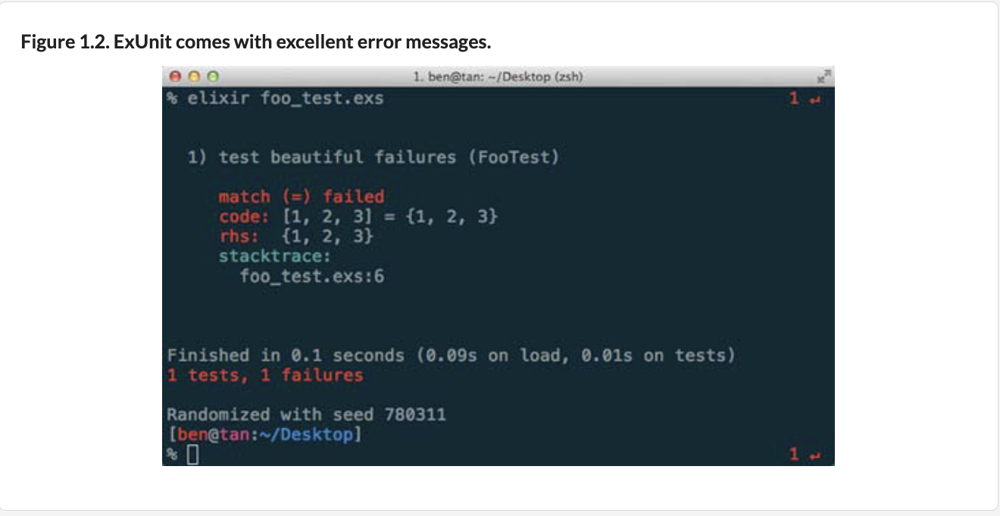

- **Erlang**: programming language created 1986 by Swedish telecommunications company Ericsson that excels in building soft `real-time, distributed, and concurrent` systems. Its original use case was to program Ericsson’s telephone switches. (Telephone switches are basically machines that connect calls between callers.)

  - These switches had to be `concurrent, reliable, and scalable`. They had to **handle multiple calls at the same time, and they also had to be extremely reliable. No one wants their call to be dropped halfway through. Additionally, a dropped call (due to a software or hardware fault) shouldn’t affect the rest of the calls on the switch. The switches had to be massively scalable and work with a distributed network of switches.** These production requirements shaped Erlang into what it is today; they’re the exact requirements we have today with multicore and web-scale programming.

  - Erlang VM’s scheduler automatically distributes workloads across processors. This means you get an increase in speed almost for free if you run your program on a machine with more processors—almost, because you’ll need to change the way you approach writing programs in Erlang and Elixir in order to reap the full benefits

  - `Distributed` programs = programs running on different computers and that can communicate with each other.

- **Elixir**: functional, meta-programming-aware language built on top of Erlang virtual machine (called BEAM)
  - `Functional`: immutable state, higher-order functions, lazy evaluation, pattern matching, etc.
  - `Meta-programmable`: code that generates code. Code can be represented as data, and data can be represented as code. Lets programmer add to the language new constructs (among other things) other languages find difficult or even downright impossible.
  - `OTP (Open Telecom Protocol)`: framework to build fault-tolerant, scalable, distributed applications. Elixir gains OTP for free because OTP comes as part of the Erlang distribution. OTP comes packaged with a lot of good stuff, including 3 kinds of databases, a set of debugging tools, profilers, a test framework, and much more.
    - `Agent`: built into `GenServer`, an abstraction around background processes maintaining state. We can access them from other processes within our application and node.
    - `Task`: handles one-off asynchronous computation. Gives way to execute a function in the background and retrieve its return value later. They can be particularly useful when handling expensive operations without blocking the application execution. Think JavaScript async/await.

Q: How is Elixir different from Erlang?
  - Similar:
    - Both Elixir and Erlang compile down to same bytecode. So both Elixir and Erlang programs, when compiled, emit instructions that run on the same VM.
    - You can call Erlang code directly from Elixir and vice versa. All Erlang third-party libraries may be used by Elixir
    - Elixir follows most of Erlang’s semantics, such as message passing.
  - Different:
    - `iex`: Interactive Elixir shell is a REPL like Ruby's `irb`
      - Lets you to connect to nodes, like as separate Erlang runtimes that can talk to each other. Each runtime can live on the same computer, the same LAN, or the same network.
      - Has debugger like Ruby's Pry called `IEx.pry`
      - Has autocomplete
    - Has built-in test framework `ExUnit`
    - Has built-in documentation system. Type `h` before Elixir function, object, etc. you want more info on.




```
require IEx

defmodule Greeter do
  def ohai(who, adjective) do
    greeting = "Ohai!, #{adjective} #{who}"
    IEx.pry
  end

end
```
- `mix`: build tool used for creating, compiling, and testing Elixir projects. It’s also used to manage dependencies, among other things. Think of it like `rake` in Ruby and `lein` in Clojure. Projects such as the `Phoenix web framework` have used mix to great effect for things like building generators that reduce the need to write boilerplate.

- Standard library: Data structures such as ranges, strict and lazy enumeration APIs, and a sane way to manipulate strings are just some of the nice items that come packaged in it.
  - Modules not in standard Erlang library, like
    - `Stream`: Streams are basically composable, lazy enumerables. They’re often used to model potentially infinite streams of values.

- Metaprogramming: has LISP-like macros built into it, minus parentheses. Macros can extend Elixir by giving it new constructs expressed in existing ones.

- `Phoenix`:  web framework written in Elixir (like Ruby on Rails). Response times in Phoenix can reach microseconds. Phoenix proves you can have both high performance and a simple framework coupled with built-in support for WebSockets and backed by awesome power of OTP.

**Q: What's Elixir/OTP good for?**

Everything that Erlang is great for also applies to Elixir. Elixir and OTP combined provide facilities to build concurrent, scalable, fault-tolerant, distributed programs. These include, but obviously aren’t limited to, the following:

- Chat servers (WhatsApp, ejabberd)
- Game servers (Wooga)
- Web frameworks (Phoenix)
- Distributed databases (Riak and CouchDB)
- Real-time bidding servers
- Video-streaming services
- Long-running services/daemons
- Command-line applications

Elixir is ideal for building server-side software, which must

- Serve multiple users and clients, often in the thousands or millions, while maintaining a decent level of responsiveness.
- Stay up in the event of failure, or have graceful failover mechanisms
- Scale gracefully by adding either more CPU cores or additional machines

**Q: What's Elixir bad for?**

You probably won’t want to do any image processing, perform computationally intensive tasks, or build GUI applications on Elixir. And you wouldn’t use Elixir to build hard real-time systems. For example, you shouldn’t use Elixir to write software for an F-22 fighter jet.

**Preview of OTP behaviors**

Let's say you build a weather application. Input: cities. Output: temperatures.

Clients (via HTTP) make requests, and your application will perform some computations and return the results to each client in a timely manner.

You implement your weather application. But as its popularity grows, your users see problems:
- slow load times
- service disruptions
- Error messages
- Mysterious deadlocks
- Other weird issues
- You attempt to do some performance profiling, you tweak settings here and there, and you try to add more concurrency.

The OTP framework is what gives languages based on BEAM virtual machine (Erlang, Elixir, etc) their superpowers, and it comes bundled with Elixir.

An OTP `behavior`: contract between you and OTP
- OTP expects you to fill in certain functions. In exchange for that, OTP takes care of issues like
  - message handling (synchronous or asynchronous)
  - concurrency errors (deadlocks and race conditions)
  - fault tolerance
  - failure handling.
  - These issues are general—almost every respectable client/server program must handle them somehow, but OTP steps in and handles all these for you.

*2 main OTP behaviors:*

1. `GenServer` ("generic server"): https://hexdocs.pm/elixir/1.15/GenServer.html#module-client-server-apis

```
defmodule WeatherService do
  use GenServer # <- This brings in GenServer behavior
  def handle_call({:temperature, city}, _from, state) do
    # ...
  end
  def handle_cast({:email_weather_report, email}, state) do
    # ...
  end
end

handle_call(request, from, state)
Invoked to handle synchronous call/3 messages. call/3 will block until a reply is received (unless the call times out or nodes are disconnected).

handle_cast(request, state)
Invoked to handle asynchronous cast/2 messages.
```

- Chapter 3: Code weather app without OTP
- Chapter 4: Code it with OTP
2. `Supervisor`

- Chapter 5: Code supervisor behavior from scratch
- Chapter 6 + 7: Code worker pool app from scratch

**Distribution for load balancing + fault tolerance**

We'll build 2 distributed apps. Distributed systems spread load across multiple computers.

- Chapter 8: Make load tester + exploit distribution to scale up app
- Chapter 9: Code app with `fault tolerance`: ability of a system (computer, network, cloud cluster, etc.) to continue operating with no interruption when any components fail.

**Dialyzer and type specifications**

- Chapter 10: Using `Dialyzer`, tool to check variables are required data types. `type specifications`, in addition to helping Dialyzer, serve as documentation.

Example from `List` module:
```
@spec foldl([elem], acc, (elem, acc -> acc)) :: acc when elem: var, acc: var
def foldl(list, acc, function) when is_list(list) and is_function(function) do
  :lists.foldl(function, acc, list)
end
```
**Property and concurrency testing**

- Chapter 11: Property + concurrency testing. Learn QuickCheck + Concuerror.

`QuickCheck`: for `property-based testing`, different from unit testing. Instead of thinking of specific examples, as in unit testing, property-based testing forces you to come up with general properties your tested code should hold. Once you’ve created a property, you can test it against hundreds or thousands of generated test inputs. Example that says reversing a list twice gives you back the same list:
```
@tag numtests: 100
property "reverse is idempotent" do
  forall l <- list(char) do
    ensure l |> Enum.reverse |> Enum.reverse == l
  end
end
```
This code makes 100 lists and asserts that property holds for each of those generated lists.

`Concuerror`: reveals hard-to-detect concurrency bugs, like deadlocks and race conditions. Through series of intentionally buggy examples, you’ll use Concuerror to find the bugs.
