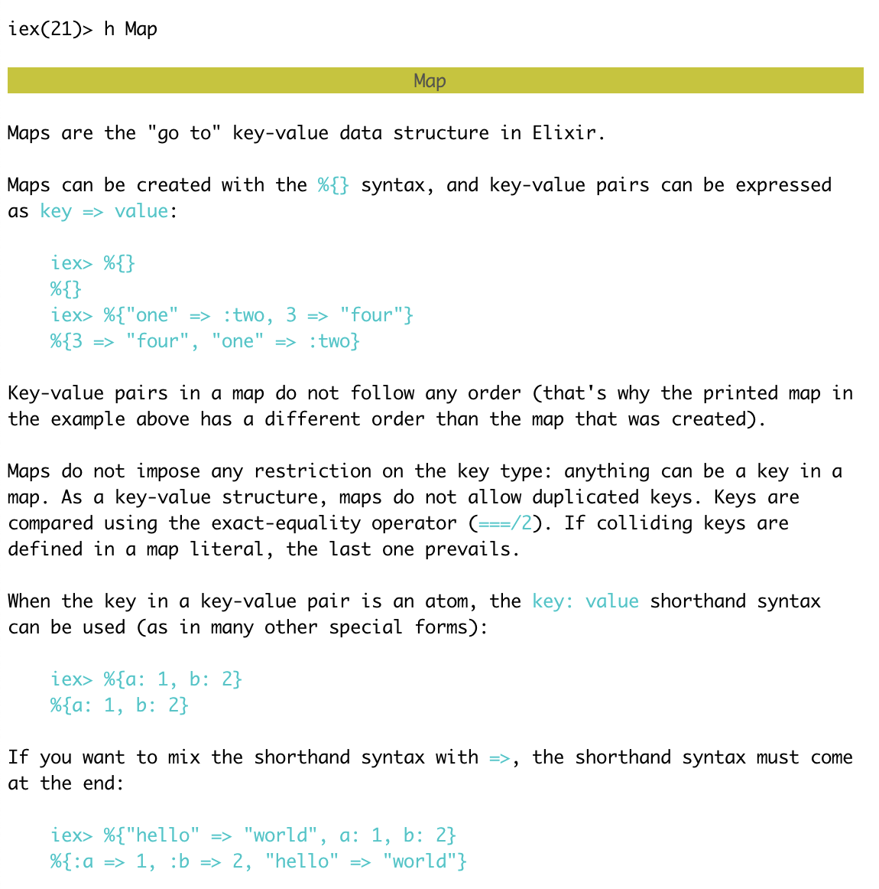
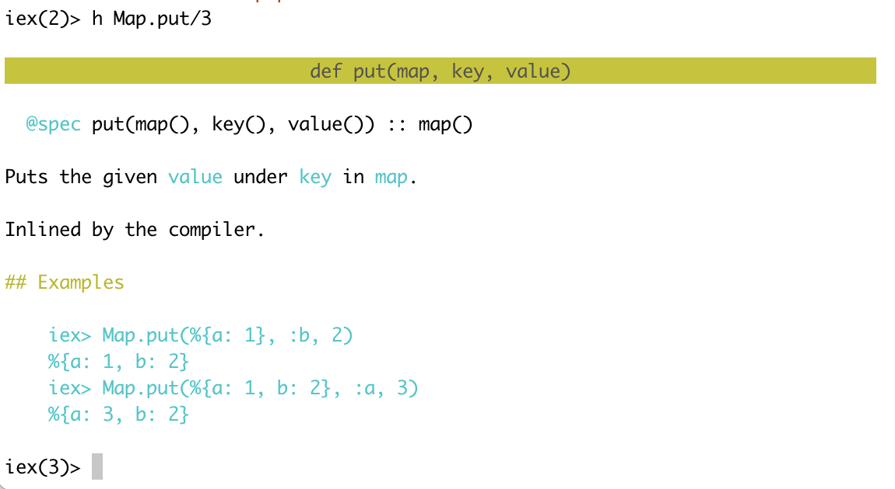

Define `length_converter.ex`. `defmodule` = new module. `def` = new function.
```
defmodule MeterToFootConverter do
  def convert(m) do
    m * 3.28084
  end
end
```
Interactive Elixir (`iex` for short) is the equivalent of `irb` in Ruby or node in Node.js. In your terminal, launch iex with the filename as the argument:
```
% iex length_converter.ex

Interactive Elixir (0.13.0) - press Ctrl+C to exit (type h() ENTER for help)
iex(1)>

iex> MeterToFeetConverter.convert(2.72)
```
Stop an Elixir program like this: Press `Ctrl-C` twice or use `System.halt`.
```
BREAK: (a)bort (c)ontinue (p)roc info (i)nfo (l)oaded
       (v)ersion (k)ill (D)b-tables (d)istribution
```
**See Elixir documentation in `iex`.** Type `h [name of Elixir module or function]` in `iex`:



To see functions available in `Map` module, type `h Map.` (with dot), then press Tab.
```
iex(1)> h Map.
delete/2             drop/2               equal?/2             fetch!/2             fetch/2              filter/2             from_keys/2
from_struct/1        get/2                get/3                get_and_update!/3    get_and_update/3     get_lazy/3           has_key?/2
intersect/2          intersect/3          keys/1               merge/2              merge/3              new/0                new/1
new/2                pop!/2               pop/2                pop/3                pop_lazy/3           put/3                put_new/3
put_new_lazy/3       reject/2             replace!/3           replace/3            replace_lazy/3       split/2              split_with/2
take/2               to_list/1            update!/3            update/4             values/1
```
To learn more about `put/3` function ("3" is `arity` of the function: # of arguments it takes), type `h Map.put/3`:


