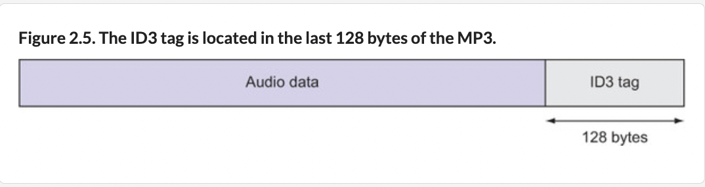
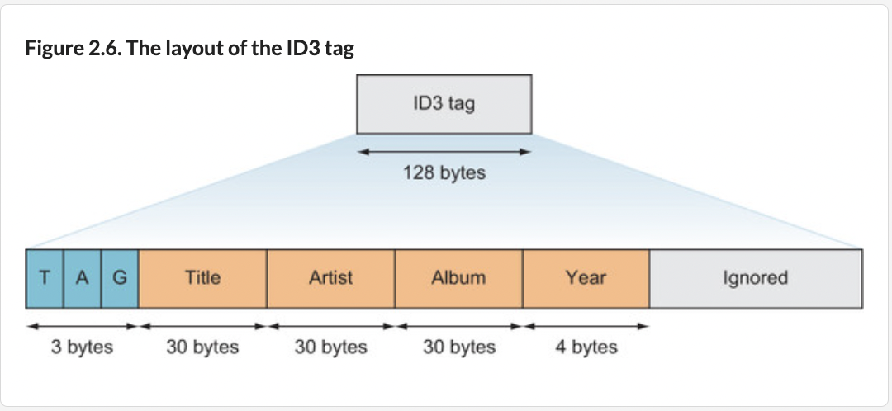
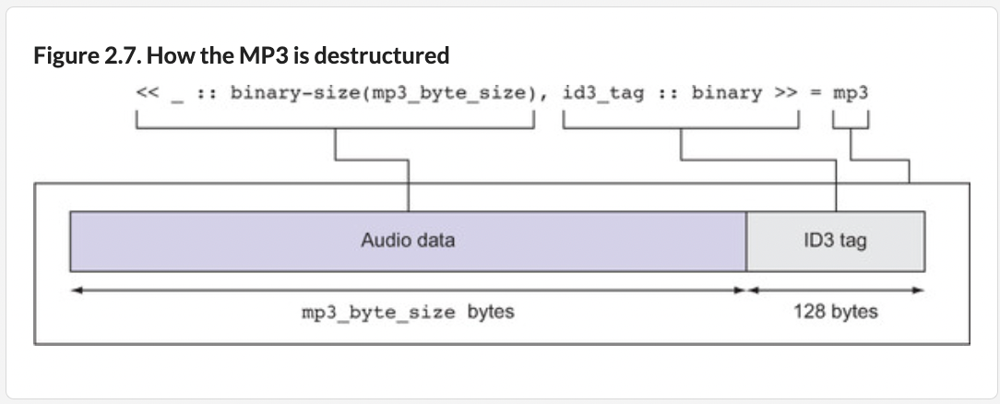
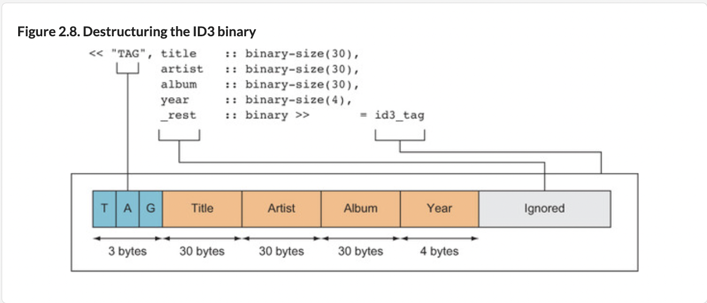

**Pattern Matching** (important in functional languages)

`=` is not just to assign/bind variables. It's also the `match operator`, matching both values and data structures.

1. Use = to assign variables:
```
programmers = Map.put(programmers, :jose, "Elixir")
```
2. Use = to match variables:
```
> %{joe: "Erlang", jose: "Elixir", matz: "Ruby", rich: "Clojure"}
 = programmers
```
This is not an assignment. Instead, a successful pattern match has occurred, since the contents of both the left side and `programmers` are identical.

Bad pattern match:
```
iex> %{tolkien: "Elvish"} = programmers
** (MatchError) no match of right hand side value: %{joe: "Erlang", jose: "Elixir", matz: "Ruby", rich: "Clojure"}

```
**Destructuring**

Destructuring allows you to bind a set of variables to a corresponding set of values anywhere that you can normally bind a value to a single variable. We can pattern match without need to specify the entire pattern.

```
> %{joe: a, jose: b, matz: c, rich: d} = %{joe: "Erlang", jose: "Elixir", matz: "Ruby", rich: "Clojure"}

> a
"Erlang"
> b
"Elixir"
> c
"Ruby"
> d
"Clojure"

> %{jose: most_awesome_language} = programmers
%{joe: "Erlang", jose: "Elixir", matz: "Ruby", rich: "Clojure"}
> most_awesome_language
"Elixir"

> Map.fetch(programmers, :rich)
{:ok, "Clojure"} <--- Map.fetch returns tuple
> Map.fetch(programmers, :rasmus)
:error
```

May use 2 different possible outputs in `case` statement:
```
case Map.fetch(programmers, :rich) do
  {:ok, language} ->
    IO.puts "#{language} is a legit language."
  :error ->
    IO.puts "No idea what language this is."
end

Clojure is a legit language.
```
Destructuring is useful to declare preconditions.

**Ex: Check if a file is readable BEFORE reading it:**

From [File.read/1](https://hexdocs.pm/elixir/1.16/File.html#read/1):
```
read(path)

@spec read(Path.t()) :: {:ok, binary()} | {:error, posix()}

Returns {:ok, binary}, where binary is a binary data object that contains the contents of path, or {:error, reason} if error occurs.

Typical error reasons:

:enoent - the file does not exist
:eacces - missing permission for reading the file, or for searching one of the parent directories
:eisdir - the named file is a directory
:enotdir - a component of the file name is not a directory; on some platforms, :enoent is returned instead
:enomem - there is not enough memory for the contents of the file

You can use :file.format_error/1 to get a descriptive string of the error.
```
For successful read, `File.read/1` returns a `{:ok, binary}` tuple. `binary()` is the entire contents of the read file.

Otherwise, a `{:error, posix}` tuple is returned. The variable `posix()` contains the error reason, an atom like `:enoent` or `:eaccess`.

Code to read a file:
```
case File.read("KISS - Beth.mp3") do
  {:ok, binary} ->
    IO.puts "KIϟϟ rocks!"
  {:error, reason} ->
    IO.puts "No Rock N Roll for anyone today because of #{reason}."
end
```
**Ex: Tic-Tac-Toe Board**

Use tuples to represent board configurations
```
def check_board(board) do
  case board do
    { :x, :x, :x,
      _ , _ , _ ,
      _ , _ , _ } -> :x_win
    { _ , _ , _ ,
      :x, :x, :x,
      _ , _ , _ } -> :x_win

    { _ , _ , _ ,
      _ , _ , _ ,
      :x, :x, :x} -> :x_win

    { :x, _ , _ ,
      :x, _ , _ ,
      :x, _ , _ } -> :x_win

    { _ , :x, _ ,
      _ , :x, _ ,
      _ , :x, _ } -> :x_win

    { _ , _ , :x,
      _ , _ , :x,
      _ , _ , :x} -> :x_win

    { :x, _ , _ ,
      _ , :x, _ ,
      _ , _ , :x} -> :x_win

    { _ , _ , :x,
      _ , :x, _ ,
      :x, _ , _ } -> :x_win

    # Player O board patterns omitted ...

    { a, b, c,
      d, e, f,
      g, h, i } when a and b and c and d and e and f and g and h and i -> :draw

    _ -> :in_progress

  end
end
```
Underscore (_) is the “don’t care” or “match everything” operator.

**Ex: Parsing an MP3 file's ID3 tag**

Elixir can parse binary data. Let's get metadata from an MP3 audio file. This is in an ID3 tag, the last 128 bytes of the MP3:


Ignore audio data portion and concentrate only on the ID3 tag. Figure 2.6 shows ID3 tag layout. The first 3 bytes are called the header and contain 3 characters: “T”, “A”, and “G”. The next 30 bytes contain the title. The next 30 bytes are the artist, followed by 30 bytes containing the album. The next 4 bytes are year (such as “2”, “0”, “1”, “4”).


[**Bitstrings**](https://hexdocs.pm/elixir/1.16/binaries-strings-and-charlists.html#bitstrings): Basic Elixir data type: a contiguous sequence of bits in memory. By default, 8 bits (1 byte) is used to store each number in a bitstring, but you can manually specify the number of bits via a `::n` modifier to denote size in `n` bits, or you can use the more verbose declaration `::size(n)`.

[**Binaries**](https://hexdocs.pm/elixir/1.16/binaries-strings-and-charlists.html#binaries): Bitstring where number of bits is a multiple of 8. Every binary is a bitstring, but not every bitstring is a binary.

We can pattern match on binaries/bitstrings. Unless we explicitly use `::` modifiers, each entry in the binary pattern is expected to match a single byte (exactly 8 bits). If we want to match on a binary of unknown size, use the `binary` modifier at end of the pattern:
```
> <<0, 1, x::binary>> = <<0, 1, 2, 3>>
<<0, 1, 2, 3>>
> x
<<2, 3>>
```
The `binary-size(n)` modifier will match `n` bytes in a binary:
```
> <<head::binary-size(2), rest::binary>> = <<0, 1, 2, 3>>
<<0, 1, 2, 3>>
> head
<<0, 1>>
> rest
<<2, 3>>
```

[bit_size/1](https://hexdocs.pm/elixir/1.12.3/Kernel.html#bit_size/1): Returns integer which is size in bits of `bitstring`. Allowed in guard tests. Inlined by compiler.
```
bit_size(bitstring)
@spec bit_size(bitstring()) :: non_neg_integer()
```
Examples:
```
> bit_size(<<433::16, 3::3>>)
19

> bit_size(<<1, 2, 3>>)
24
```

[byte_size/1](https://hexdocs.pm/elixir/1.12.3/Kernel.html#byte_size/1): Returns number of bytes needed to contain `bitstring`. If number of bits in `bitstring` not divisible by 8, the resulting number of bytes will be rounded up (by excess). This operation happens in constant time. Allowed in guard tests. Inlined by the compiler.
```
byte_size(bitstring)
@spec byte_size(bitstring()) :: non_neg_integer()
```
Examples:
```
> byte_size(<<433::16, 3::3>>)
3

> byte_size(<<1, 2, 3>>)
3
```
How to extract metadata from audio MP3 file? [Code](code/id3.ex):
```
defmodule ID3Parser do
  def parse(file_name) do
    case File.read(file_name) do
      {:ok, mp3} ->
        audio_data_byte_size = byte_size(mp3) - 128
        <<_::binary-size(audio_data_byte_size), id3_tag::binary>> = mp3

        <<"TAG", song::binary-size(30), artist::binary-size(30), album::binary-size(30),
          year::binary-size(4), _rest::binary>> = id3_tag

        # Extract printable part of each binary string. Exclude null bytes <<0>>
        [song2, _null_bytes] = String.chunk(song, :printable)
        [artist2, _null_bytes] = String.chunk(artist, :printable)
        [album2, _null_bytes] = String.chunk(album, :printable)

        IO.puts("Song: #{song2}, Artist: #{artist2}, Album: #{album2}, Year: #{year}")

      _ ->
        IO.puts("Couldn't open #{file_name}")
    end
  end
end
```
Run code:
```
> iex id3.ex
> ID3Parser.parse("Vogue.mp3")
Artist: Madonna, Song: Vogue, Album: I'm Breathless, Year: 1990
```
How does code work?

- Program reads the MP3. If file is readable, it returns a tuple matching `{:ok, mp3}`, where `mp3` contains binary contents of the file. Otherwise, the catch-all `_` operator will match a failed file read.

`{:ok, mp3} = File.read(file_name)`

- Since we only care about the ID3 tag, skip past the audio binary part. First compute byte size of the audio binary part (`mp3_byte_size`, which I renamed `audio_data_byte_size`):

`audio_data_byte_size = byte_size(mp3) - 128`

- Use that info to destructure the binary. Pattern-match the MP3 by declaring a pattern on the left and the mp3 variable on the right. `<< >>`  represents an Elixir binary. Declare we don't care about the audio part by specifying the audio binary size:

`<<_::binary-size(audio_data_byte_size), id3_tag::binary>> = mp3`

- What remains is the ID3 tag, captured in `id3_tag` variable. Now we can extract metadata from the ID3 tag!



- To do that, do another pattern match with the declared pattern on the left and `id3_tag` on the right. By declaring the right number of bytes, we can capture the song, artist, and other information in their respective variables.



I renamed `title` to `song`. Original book code says:

`IO.puts("Song: #{song}, Artist: #{artist}, Album: #{album}, Year: #{year}")`

But that returns:

`Artist: Madonna^ ^ ^ ^ ^ ^ ^ ^ ^ ^ ^ ^ ^ ^ ^ ^ ^ ^ ^ ^ ^ ^ ^ , Title: Vogue^ ^ ^ ^ ^ ^ ^ ^ ^ ^ ^ ^ ^ ^ ^ ^ ^ ^ ^ ^ ^ ^ ^ ^ ^ , Album: I'm Breathless^ ^ ^ ^ ^ ^ ^ ^ ^ ^ ^ ^ ^ ^ ^ ^ , Year: 1990`

That's because after pattern matching, the variables (like `artist`) look like:

`<<77, 97, 100, 111, 110, 110, 97, 0, 0, 0, 0, 0, 0, 0, 0, 0, 0, 0, 0, 0, 0, 0,
  0, 0, 0, 0, 0, 0, 0, 0>>`

All strings in Elixir are binary. Only the first 7 bytes `<<77, 97, 100, 111, 110, 110, 97>>` is "Madonna", but the other 23 of 30 bytes are just null bytes: `<<0, 0, 0, ...0>>`. When printed, `<<0>>` looks like `^`.

To extract the human-readable parts of these strings, I use [String.chunk/2](https://hexdocs.pm/elixir/1.16/String.html#chunk/2):

`:printable` - string is split into chunks of printable and non-printable character sequences

```
> [artist2, _null_bytes] = String.chunk(artist, :printable)
> artist2
Madonna
```
