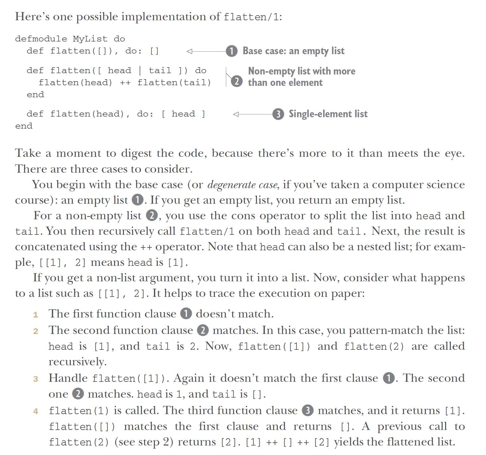

**[Lists](https://hexdocs.pm/elixir/List.html)**

Lists are a major Elixir data type. They're linked lists, NOT arrays! Random access of any element takes linear O(n) time complexity.

[Why does Elixir mainly use Linked Lists, not Arrays?](https://www.freecodecamp.org/news/elixir-why-linked-lists-aa6828b6b099/) 2 reasons: immutability + structural sharing.

In Elixir (like most functional languages), data are immutable.

**`Immutable` means once data is declared, it cannot be mutated/changed anymore.**
If you know [how arrays work under the hood](https://dev.to/edisonywh/how-arrays-work-the-way-arrays-work-3bpg), see what happens if we try to implement immutability with an array!

An array is defined as a continuous block of memory. The problem is that an array of 5 elements is still just ONE array, and when we are adding/deleting an element, we are MUTATING it. How can we use immutability with arrays then? It’s not impossible, but here's why that’s not practical.

**To enforce true immutability in arrays, we must make a full copy of the old array each time we want to add/delete in the array.**

If you have an array of size 5, to add a new item to it, our memory usage instantly doubles. We must keep the old array as is, then also make a array copy of the same elements. That’s just space complexity. Also think of time complexity!

A linked list lacks the same constraints, since its nodes are all stored in separate places in memory, not next to each other. **Adding/deleting nodes to a list takes O(1) constant time, regardless of its size.**

Linked lists are recursive, by definition. Ex: `A -> B -> C -> D` is a linked list, but so is `B -> C -> D`, `C -> D`, etc., and each linked list here is part of another linked list! The recursive nature, plus that data must be immutable (so you can’t have a loop counter) is why functional languages are usually associated with recursion.

`A -> B -> C -> D` is a different list from `B -> C -> D` (though one recursively contains the other one). Since we have that guarantee (plus the fact a list CAN'T change), **we don't have to define the same data twice and we can reuse existing linked lists**! This is called `structural sharing`.

[Difference between Arrays vs. Lists in Elixir](https://hexdocs.pm/arrays/Arrays.html#module-arrays-vs-lists):

- Arrays keep track of their size, which must be computed.
- Arrays allow fast¹ element `indexing`. Indexing later elements in a list slows down linearly in the size of the list.
- Arrays allow fast `slicing`. For lists, this slows down the further away from the head of the list we are.
- Pushing a single element to the end of an array is fast¹. **Pushing a single element to the end of a list is very slow (the whole list needs to be copied), taking linear time.**
- Pushing a single element to the start of an array is slow, taking linear time (the whole array must be moved forward by 1 memory address). **Pushing a single element to the head of a list is fast, taking constant time.**
- Concatenating arrays takes time proportional to the size of the second array (individual elements are pushed to the end). **Concatenating 2 lists takes time proportional to the length of the first list. This means that repeated appending**
- Arrays are always well-formed. In certain cases, Lists are allowed to be improper.
- **Many common operations in Elixir transform an enumerable into a list automatically.** Arrays are made using [Arrays.new/0](https://hexdocs.pm/arrays/Arrays.html#new/0), [Arrays.new/1](https://hexdocs.pm/arrays/Arrays.html#new/1), [Arrays.empty/0](https://hexdocs.pm/arrays/Arrays.html#empty/0), the `into:` option on a `for`, or [Enum.into](https://hexdocs.pm/elixir/1.16/Enum.html#into/2).

¹: Depending on implementation, 'fast' is either O(1) (constant time, regardless of array size) or O(log(n)) (logarithmic time, becoming a constant amount slower each time array doubles in size.)

**An element can be prepended to a start of list with `|` (["cons" operator](https://en.wikipedia.org/wiki/Cons)). `|` also separates the head and tail of a list, which is destructured.**
```
> [3 | []]
[3]

> [1 | [2 | [3 | []]]]
[1, 2, 3]

> [head | tail] = [1, 2, 3]
[1, 2, 3]

> head
1

> tail
[2, 3]

> list = [1, 2, 3]
> [0 | list]
[0, 1, 2, 3]
```

Start at the outermost box. This says head of the list is 1, followed by the tail of the list. This tail is another list: the head of that list is 2, followed by its tail, again another list. Finally, this 3rd box's list is a head of 3 and a tail. That tail is an empty list. **The tail of the final element of any list is always an empty list. Recursive functions make use of this fact to determine when the end of a list is reached.**

2 lists may be concatenated ([++/2](https://hexdocs.pm/elixir/Kernel.html#++/2)) and subtracted ([--/2](https://hexdocs.pm/elixir/Kernel.html#--/2)):
```
> [1, 2, 3] ++ [4, 5, 6]
[1, 2, 3, 4, 5, 6]

> [1, true, 2, false, 3, true] -- [true, false]
[1, 2, 3, true]
```
`improper lists` do not have an empty list as the second element in the last cons cell. We usually avoid improper lists, but they're in special cases like `iodata` and `chardata` (see [IO module](https://hexdocs.pm/elixir/IO.html)):
```
> [1 | [2 | [3 | 4]]]
[1, 2, 3 | 4]
```
Due to their cons cell based representation, **prepending an element to a list is always fast (constant time), while appending (to end of list) is slower as list grows in size (linear time)**:
```
> list = [1, 2, 3]
> [0 | list] # fast
[0, 1, 2, 3]

> list ++ [4] # slow
[1, 2, 3, 4]
```
Single element list:
```
> [ head | tail ] = [:lonely]
[:lonely]

> head
:lonely

> tail
[]
```
**Ex: Flattening a list**

Write our own version of [List.flatten/1](https://hexdocs.pm/elixir/List.html#flatten/1), which flattens a nested list. Ex:
```
> List.flatten [1, [:two], ["three", []]]
[1, :two, "three"]
```

Solution:
```
defmodule MyList do
  def flatten([ head | tail ]) do
    flatten(head) ++ flatten(tail)
  end

  def flatten([]), do: []

  def flatten(head), do: [ head ]
end
```

Ex: `MyList.flatten([1, [:two], ["three", []]])`
```
[head | tail] = [1, [:two], ["three", []]]
head = 1
tail = [[:two], ["three", []]]
becomes flatten(1) ++ flatten([[:two], ["three", []]])

flatten(1) = [1]

flatten([[:two], ["three", []]])
[head | tail] = [[:two], ["three", []]]
head = [:two]
tail = [["three", []]]
becomes flatten([:two]) ++ flatten([["three", []]])

flatten([:two])
[head | tail] = [:two]
head = :two
tail = []
becomes flatten(:two) ++ flatten([]) = [:two] ++ [] = [:two]

flatten([["three", []]])
[head | tail] = [["three", []]]
head = ["three", []]
tail = []
becomes flatten(["three", []]) ++ flatten([]) = flatten(["three", []]) ++ []

flatten(["three", []])
[head | tail] = ["three", []]
head = "three"
tail = [[]]
becomes flatten("three") ++ flatten([[]]) = ["three"] ++ flatten([[]])

flatten([[]])
[head | tail] = [[]]
head = []
tail = []
becomes flatten([]) ++ flatten([]) = [] ++ [] = []
```
Combining all recursive results:
```
[1] ++ [:two] ++ ["three"] ++ [] ++ [] = [1, :two, "three"]
```
**Ordering of function clauses**

The order of function clauses matters! What if we switch order of `MyList.flatten`'s last 2 functions?
```
defmodule MyList do
  def flatten([ head | tail ]) do
    flatten(head) ++ flatten(tail)
  end

  def flatten(head), do: [ head ]

  def flatten([]), do: [] <--- this function never runs!
end
```
Running `MyList.flatten([])` gives `warning: this clause for flatten/1 cannot match because a previous clause at line 66 always matches`.

Since second function `def flatten(head), do: [ head ]` matches `[]`, the third function `def flatten([]), do: []` never runs! An unmatched clause can mean dead code or an infinite loop.
