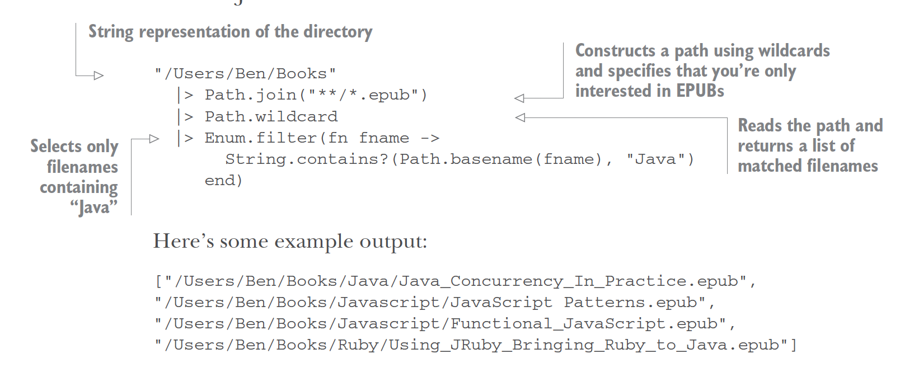

**Pipe Operator (`|>`)**

The pipe operator (`|>`) takes result of expression on left and inserts it as first parameter of function call on the right.

Instead of
```
defmodule URLWorker do
  def start(url) do
    do_request(HTTPoison.get(url))
  end
  # ...
end
```
Use pipe operators. The more you use it, the more you’ll see data as being transformed from one form to another, like an assembly line.
```
defmodule URLWorker do
  def start(url) do
    result = url |> HTTPoison.get |> do_request
  end
  # ...
end
```
**Ex: Filtering files in directory by filename**

Let’s say you have a directory filled with e-books. This directory may have nested folders. You want to get filenames of only the Java-related EPUBs. You only want books with filenames that end with `*.epub` and include `Java`:

It’s nice to read code in which steps are so explicit and obvious.

**Erlang interoperability**

Since both Elixir and Erlang share the same bytecode, calling Erlang code doesn’t affect performance in any way. **We may call any Erlang library with Elixir code!**

Erlang's [:random.uniform/1](https://www.erlang.org/doc/man/random#uniform-1) function:
```
Make random number in Erlang:

> random:uniform(123).
55

Use same Erlang function in Elixir:

> :random.uniform(123)
55
```
Note positions of colon and dot. Those are the only differences between Erlang + Elixir syntax for Erlang functions!

We may see documentation for Erlang functions in `iex`:
```
> h :random.uniform/1

                                   uniform/1

  @spec uniform(n) :: pos_integer() when n: pos_integer()

deprecated: random:uniform/1 is deprecated; use the 'rand' module instead

Returns, for a specified integer N >= 1, a random integer uniformly distributed
between 1 and N, updating the state in the process dictionary.
```
**Calling Erlang HTTP client in Elixir**

When Elixir lacks a feature, check if Erlang has a standard library function we can use before searching for third-party libraries.

To download a web page, we need an HTTP client. Elixir doesn’t come with a built-in HTTP client.It doesn’t need to, since Erlang comes with [:httpc.request/1](https://www.erlang.org/doc/man/httpc#request-1). Also see [:httpc cheatsheet](https://elixirforum.com/t/httpc-cheatsheet/50337).

First start the `inets` application (it’s in the Erlang doc), then make the HTTP request:
```
> :inets.start
:ok

> {:ok, {status, headers, body}} = :httpc.request 'http://www.elixir-lang.org'

{:ok,
 {{~c"HTTP/1.1", 200, ~c"OK"},
  [
    {~c"cache-control", ~c"max-age=600"},
    {~c"connection", ~c"keep-alive"},
    {~c"date", ~c"Sun, 24 Dec 2023 16:53:03 GMT"},
    {~c"via", ~c"1.1 varnish"},
    ...

> status
{~c"HTTP/1.1", 200, ~c"OK"}

> headers
[
  {~c"cache-control", ~c"max-age=600"},
  {~c"connection", ~c"keep-alive"},
  {~c"date", ~c"Sun, 24 Dec 2023 16:53:53 GMT"},
  {~c"via", ~c"1.1 varnish"},
  {~c"accept-ranges", ~c"bytes"},
...

> body
~c"<!DOCTYPE html>\n<html xmlns=\"http://www.w3.org/1999/xhtml\" lang=\"en\">\n<head>\n  <meta http-equiv=\"Content-Type\" content=\"text/html; charset=UTF-8\" />\n  <meta http-equiv=\"X-UA-Compatible\" content=\"IE=edge\" />\n  <meta name=\"description\" content=\"Welcome to Elixir, a dynamic, functional language designed for building scalable and maintainable applications\">\n  <title>The Elixir programming language</title>\n  <link href=\"https://elixir-lang.org/atom.xml\" rel=\"alternate\" title=\"Elixir's Blog\" type=\"application/atom+xml\" />\n  <link rel=\"stylesheet\" type=\"text/css\" href=\"/css/style.css\" />\n  <link rel=\"stylesheet\" type=\"text/css\"
...
```
