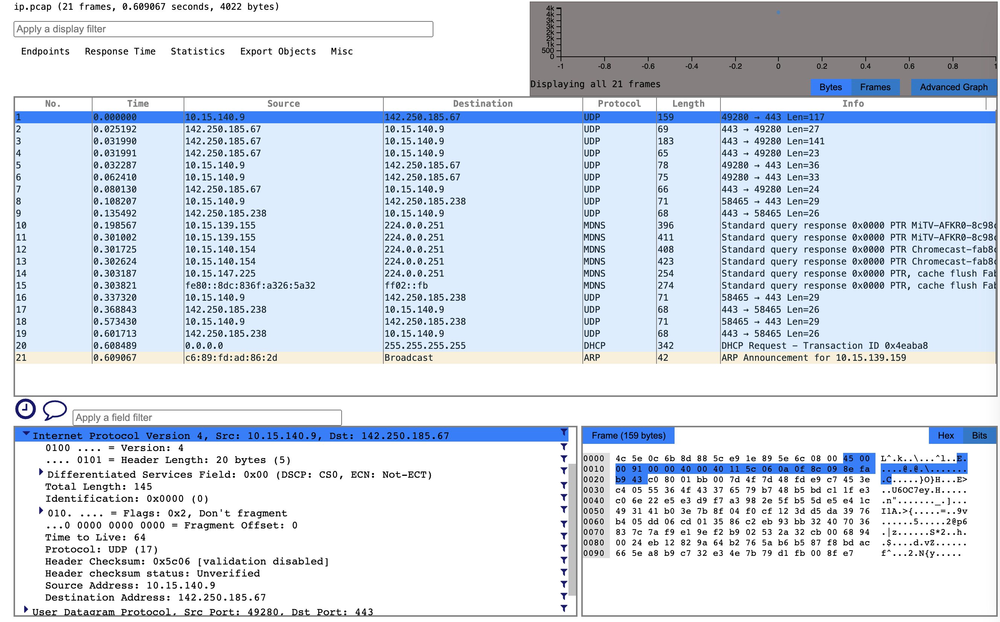
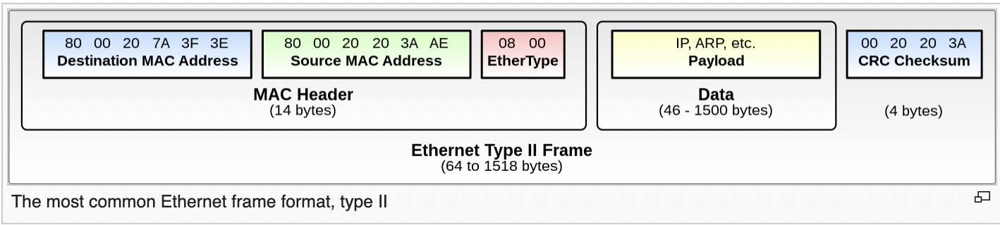
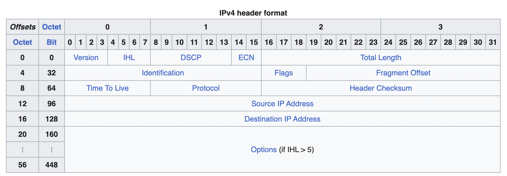

**Chp. 2 Exercises**

1. Implement [Enum.sum/1](https://hexdocs.pm/elixir/Enum.html#sum/1). Function takes either a [list](2.6_lists.md) [1, 2, 3] or [range](https://hexdocs.pm/elixir/Range.html) (1..5) of numbers and returns its sum. 3 different solutions:
- With [Enum.reduce/3](https://hexdocs.pm/elixir/Enum.html#reduce/3)
- With [recursion](https://www.leighhalliday.com/recursion-in-elixir)
- With [for/1](https://hexdocs.pm/elixir/Kernel.SpecialForms.html#for/1) (list comprehension) with [`:reduce`](https://hexdocs.pm/elixir/Kernel.SpecialForms.html#for/1-the-reduce-option) option: [Elixir doc](https://hexdocs.pm/elixir/comprehensions.html) | [Elixir School](https://elixirschool.com/en/lessons/basics/comprehensions) | [for comprehension with :reduce](https://www.mitchellhanberg.com/the-comprehensive-guide-to-elixirs-for-comprehension/#reduce)

[Answer (includes software tests)](code/exercise2.1_sum.exs). Type `elixir exercise2.1_sum.exs` to run tests.

2.  Explore [Enum](https://hexdocs.pm/elixir/Enum.html#content) module and learn its functions. See [Enum cheatsheet](https://hexdocs.pm/elixir/enum-cheat.html).

3.  Transform `[1,[[2],3]]` to `[9, 4, 1]` with and without pipe operator (`|>`).

[Answer](code/exercise2.3_transform.exs)

4.  Translate `erlang:md5("Tales from the Crypt").` from Erlang to Elixir. Answer has [:erlang.md5/1](https://www.erlang.org/doc/man/erlang#md5-1):
```
Erlang way:
> erlang:md5("Tales from the Crypt").
<<79,132,235,77,3,224,121,88,98,75,61,67,62,16,233,91>>

Elixir way:
> :erlang.md5("Tales from the Crypt")
<<79, 132, 235, 77, 3, 224, 121, 88, 98, 75, 61, 67, 62, 16, 233, 91>>
```

5.  Explore official Elixir [“Getting Started” guide](https://hexdocs.pm/elixir/introduction.html).
_______
**6.  Write parser for an [IPv4 packet header](https://en.wikipedia.org/wiki/Internet_Protocol_version_4#Packet_structure).** [Detailed video](https://www.youtube.com/watch?v=aQB22y4liXA) on IPv4 packet header. Spec for [PCAP File Format](https://ietf-opsawg-wg.github.io/draft-ietf-opsawg-pcap/draft-ietf-opsawg-pcap.html#name-general-file-structure).

Excellent posts on decoding packets: [How to Decode Network Packet Hex Dump](https://www.linkedin.com/pulse/decode-network-packet-hex-dump-chance-johnson/), [Packet Addict: IPv4 Packets](https://cybernomad.online/2014/06/24/packet-addict-ipv4-packets/), and [Reading Packet Hex Dumps Manually](https://ntquan87.wordpress.com/2015/08/17/reading-packet-hex-dumps-manually-no-wireshark/). Plus see [Hex Packet Decoder](https://hpd.gasmi.net/).

- First I [installed Wireshark](https://www.wireshark.org/docs/wsug_html_chunked/ChBuildInstallOSXInstall.html) to capture network packets.
- Then I ran [dumpcap](https://www.thegeekdiary.com/dumpcap-a-network-traffic-dump-tool/) to use the command line to save packets to a file. `dumpcap -D` lists all network interfaces. Interface 1 = "1. en0 (Wi-Fi)"
- Used `dumpcap -i 1 -P` to save packets to a temp `.pcap` file. I prefer the old `.pcap` format to the new `.pcapng` format, since it's easier to understand. [PCAP File Format](https://ietf-opsawg-wg.github.io/draft-ietf-opsawg-pcap/draft-ietf-opsawg-pcap.html#name-general-file-structure). [PCAP Next Generation File Format](https://ietf-opsawg-wg.github.io/draft-ietf-opsawg-pcap/draft-ietf-opsawg-pcapng.html#name-general-file-structure). **Tell me if you can explain how to parse a `.pcapng` file!**
- Saved the temp `.pcap` file to `ip.pcap` in our directory `~/elixir-otp-guidebook/ch2/code`
- To open `ip.pcap` in VS Code, I installed extension [vsc-webshark](https://marketplace.visualstudio.com/items?itemName=mbehr1.vsc-webshark). As I [said on Stack Overflow](https://stackoverflow.com/a/77722223/2175188), I use `/Applications/Wireshark.app/Contents/MacOS/sharkd` as full path for `sharkd`.
- Opening `ip.pcap` in VS Code shows similar view as Wireshark:

- [How to Decode Network Packet Hex Dump](https://www.linkedin.com/pulse/decode-network-packet-hex-dump-chance-johnson/) says for `.pcap` format, skip first 24 + 16 = 40 bytes to get to start of the [Ethernet frame](https://en.wikipedia.org/wiki/Ethernet_frame). In screenshot above, note the 159 byte Ethernet frame of hex data on right. Skip the 14 byte MAC Header (next 6 + 6 + 2 bytes) to get the IPv4 Packet header. Thus we skip the first 54 bytes of our `.pcap` file before we start decoding the IPv4 Packet Header, in "Data" section below:

- My 159 byte example above is Ethernet frame #1 in my `ip.pcap` file.

I should get this result (from Wireshark):
```
Internet Protocol Version 4, Src: 10.15.140.9, Dst: 142.250.185.67
  0100 .... = Version: 4
  .... 0101 = Header Length: 20 bytes (5)
  Differentiated Services Field: 0x00 (DSCP: CS0, ECN: Not-ECT)
    0000 00.. = Differentiated Services Codepoint: Default (0)
    .... ..00 = Explicit Congestion Notification: Not ECN-Capable Transport (0)
  Total Length: 145
  Identification: 0x0000 (0)
  010. .... = Flags: 0x2, Don't fragment
    0... .... = Reserved bit: Not set
    .1.. .... = Don't fragment: Set
    ..0. .... = More fragments: Not set
  ...0 0000 0000 0000 = Fragment Offset: 0
  Time to Live: 64
  Protocol: UDP (17)
  Header Checksum: 0x5c06 [validation disabled]
  Header checksum status: Unverified
  Source Address: 10.15.140.9
  Destination Address: 142.250.185.67
```


For my Ethernet frame #1 example, I must decode these 20 hex bytes:

`45 00 00 91 00 00 40 00 40 11 5c 06 0a 0f 8c 09 8e fa b9 43`

Elixir coverts these 20 hex bytes to these 20 decimal bytes:

`<<69, 0, 0, 145, 0, 0, 64, 0, 64, 17, 92, 6, 10, 15, 140, 9, 142, 250, 185, 67>>`
- On each IPv4 field for my example:
  - **Version** is first 4 bits (0100) = 4. Tells the IP version used, clearly 4.
  - **Internet Header Length (IHL)** is second 4 bits (0101) = 5. IHL is number of 32 bit (4 byte) words in the IPv4 header. So 5x4 = 20 bytes. Sticking both Version and IHL together is why the first hex byte above = first 8 bits = 01000101 = "4" + "5" = "`45`" (hex) = <<`69`>> (decimal)
  - **Differentiated Services Code Point (DSCP)** is next 6 bits = 0000 00.. = 0. Real-time data streaming makes use of this field. An example is Voice over IP (VoIP), used for interactive voice services.
  - **Explicit Congestion Notification (ECN)** is next 2 bits = .... ..00 = 0. Combining 8 bits of DSCP + ECN = 0000 0000 = "`00`" (hex) = <<`0`>> (decimal). It allows end-to-end notification of network congestion without dropping packets.
  - **Total Length** is next 2 bytes = next 16 bits = 00000000 10010001 = "`00 91`" (hex) = <<`0, 145`>> (decimal). It's the full packet size in bytes, with IPv4 header and data. Our above example is 159 bytes for Ethernet frame #1. 159 - 14 bytes (MAC header) = 145 bytes.
  - **Identification** is next 2 bytes = 16 zeros = "`00 00`" (hex) = <<`0, 0`>> (decimal) = 0. If the IP datagram is fragmented (broken into smaller pieces), this field helps uniquely identify fragments and determine to which IP packet they belong.
  - **Flags** is next 3 bits. Here it's 010 = "Don't Fragment."
  - **Fragment Offset** is next 13 bits. Here it's 0 0000 0000 0000 = 0. Combining 16 bits of Flags + Fragment Offset = 0100 0000 0000 0000 = "`40 00`" (hex) = <<`64`, `0`>> (decimal)
  - **Time to Live** is next 1 byte = "`40`" (hex) = <<`64`>> (decimal) = 64 secs
  - **Protocol** is next 1 byte = "`11`" (hex) = <<`17`>> (decimal). [Here](https://en.wikipedia.org/wiki/List_of_IP_protocol_numbers) 17 = UDP.
  - **Header Checksum** is next 2 bytes = "`5C 06`" (hex) = <<`92, 6`>> (decimal)
  - **Source IP Address** is next 4 bytes = "`0a 0f 8c 09`" (hex) = <<`10, 15, 140, 9`>> (decimal) = 10.15.140.9
  - **Destination IP Address** is next 4 bytes = "`8e fa b9 43`" (hex) = <<`142, 250, 185, 67`>> (decimal) = 142.250.185.67

[Answer](code/exercise2.6_ipv4_parser.exs)
