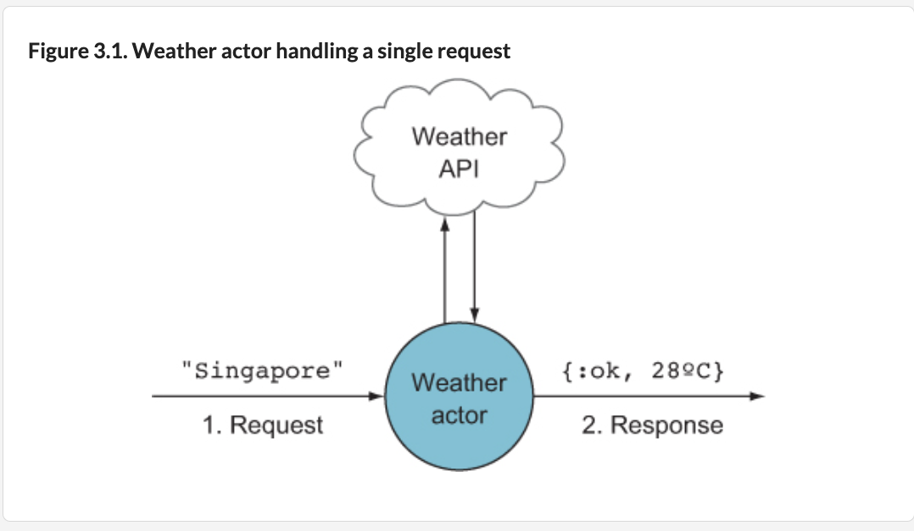
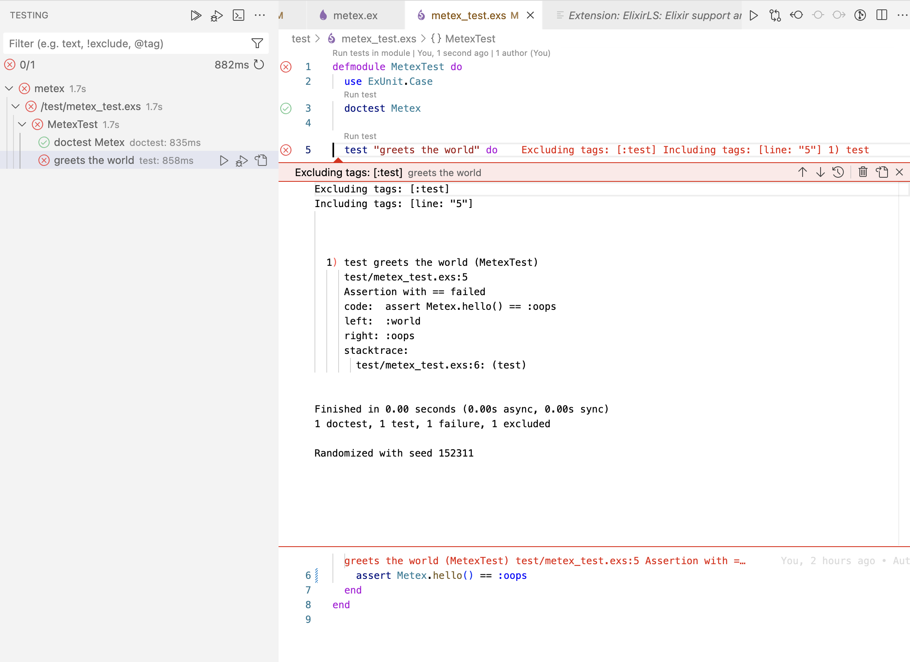

## Processes
Jump to [Running Software Tests](#tests).

For more, see:

Elixir School: [Actor Model and Processes](../elixir_school/concurrency-processes_agents_tasks.md) and MIT course: [Processes vs. Threads](../elixir_school/mit_concurrency-process_thread_race-conditions.md#processes).

 Processes are the fundamental units of concurrency in Elixir. The Erlang VM supports up to [134 million (!) processes](https://www.erlang.org/doc/man/erl.html#max_processes), which would cause all your CPUs to light up. Erlang processes are independent of the operating system; they’re lighter weight and take microseconds to create.

 Erlang (and thus Elixir) uses the [Actor concurrency model](https://en.wikipedia.org/wiki/Actor_model#Fundamental_concepts). This means:

- Each actor is a process.
- Each process performs a specific task.
- To tell a process to do something, you must send it a message. The process can reply by sending back another message.
- The kinds of messages the process can act on are specific to the process itself. In other words, messages are [pattern-matched](../ch2/2.5_pattern-matching.md).
- Other than that, processes don’t share any information with other processes.

Actors are like people. We communicate with each other by talking. Suppose my wife tells me to do the dishes. Of course, I respond by doing them. But if my wife tells me to eat my vegetables, she’ll be ignored. I won’t respond to that. So I’m choosing to respond only to certain kinds of messages. In addition, I don’t know what goes on inside her head, and she doesn’t know what goes on inside my head. The actor concurrency model acts the same way: it responds only to certain kinds of messages.

**Building a weather app, "metex"**

Let's build a program to report temperature of a given city/state/country.

Version 1: Accept single argument with a location, then report its temperature (Celsius). We make an HTTP request to an external weather service, then parse its JSON response to get temperature.



What if we want to find temperatures in 100 cities simultaneously? Assuming each request takes 1 second, would we wait 100 seconds? No way! We'll see how to make concurrent requests. With concurrency, we never know the order of responses. Imagine we pass in a list of cities in alphabetical order. How can we ensure responses are in the correct order?

Start with a naive version with NO concurrency. We'll learn to:
- Install and use third-party libraries using [mix](https://hexdocs.pm/elixir/introduction-to-mix.html)
- Make an HTTP request to a third-party API
- Parse a JSON response using pattern matching
- Use pipes to help data transformation

***Create New Project***

Use `mix new metex` to make new Elixir project, `metex`.
```
> mix new metex
* creating README.md
* creating .formatter.exs
* creating .gitignore
* creating mix.exs
* creating lib
* creating lib/metex.ex
* creating test
* creating test/test_helper.exs
* creating test/metex_test.exs

Your Mix project was created successfully.
You can use "mix" to compile it, test it, and more:

    cd metex
    mix test
```
`mix.exs` says:
```
defmodule Metex.MixProject do
  use Mix.Project

  def project do
    [
      app: :metex,
      version: "0.1.0",
      elixir: "~> 1.15",
      start_permanent: Mix.env() == :prod,
      deps: deps()
    ]
  end

  # Run "mix help compile.app" to learn about applications.
  def application do
    [
      extra_applications: [:logger]
    ]
  end

  # Run "mix help deps" to learn about dependencies.
  defp deps do
    [
      # {:dep_from_hexpm, "~> 0.3.0"},
      # {:dep_from_git, git: "https://github.com/elixir-lang/my_dep.git", tag: "0.1.0"}
    ]
  end
end
```
Every project generated by `mix` contains file `mix.exs`. It consists of two public functions: `project()` and `application()`. The project function sets up the project. It sets up project dependencies by invoking the `deps()` private function. `deps()` is an empty list for now. `application()` generates an application resource file. Certain dependencies in Elixir must be started in a specific way; such dependencies are declared in `application()`. For example, before the application starts, the `logger()` app runs first.

From [Introduction to Mix](https://hexdocs.pm/elixir/introduction-to-mix.html#project-compilation):

There is also a private function named `deps()`, invoked from the `project()` function, that defines our project dependencies. Defining `deps()` as a separate function is not required but it helps keep the project configuration tidy.

`Mix` also generates file `lib/metex.ex` with module containing one function `hello()`:
```
defmodule Metex do
  @moduledoc """
  Documentation for `Metex`.
  """

  @doc """
  Hello world.

  ## Examples

      iex> Metex.hello()
      :world

  """
  def hello do
    :world
  end
end
```
This structure is enough to compile our project:

```
> cd metex
> mix compile

Compiling 1 file (.ex)
Generated metex app
```

The `lib/metex.ex` file was compiled and an application manifest named `metex.app` was generated. All compilation artifacts are placed inside the `_build` directory using the options defined in the `mix.exs` file.

Once the project is compiled, you can start a `iex` session inside the project by running the command below. The -S mix is necessary to load the project in the interactive shell:
```
> iex -S mix
```
While we may start a new session whenever you change the project source code, we can recompile the project from within `iex` with the `recompile` helper, like this:

```
> recompile()
Compiling 1 file (.ex)
:ok
> recompile()
:noop
```
If anything had to be compiled, you see some informative text, and get the `:ok` atom back, otherwise the function is silent and returns `:noop`.

Add 2 dependencies to `deps()`: [HTTPoison](https://github.com/edgurgel/httpoison) and [jason](https://github.com/michalmuskala/jason)
```
defp deps do
  [
    {:httpoison, "~> 2.2.1"},
    {:jason,     "~> 1.4.0"}
  ]
end
```
In `metex` directory, install these dependencies with
```
> mix deps.get

Resolving Hex dependencies...
Resolution completed in 0.126s
New:
  certifi 2.12.0
  hackney 1.20.1
  httpoison 2.2.1
  idna 6.1.1
  jason 1.4.1
  metrics 1.0.1
  mimerl 1.2.0
  parse_trans 3.4.1
  ssl_verify_fun 1.1.7
  unicode_util_compat 0.7.0
* Getting httpoison (Hex package)
* Getting jason (Hex package)
* Getting hackney (Hex package)
* Getting certifi (Hex package)
* Getting idna (Hex package)
* Getting metrics (Hex package)
* Getting mimerl (Hex package)
* Getting parse_trans (Hex package)
* Getting ssl_verify_fun (Hex package)
* Getting unicode_util_compat (Hex package)
```
***Running Tests***
<a id="tests"></a>

`Mix` also generated the appropriate structure to run our project tests. Mix projects usually have `<filename>_test.exs` file in `test` directory for each file in `lib` directory. Thus we see a `test/metex_test.exs` corresponding to our `lib/metex.ex` file:
```
defmodule MetexTest do
  use ExUnit.Case
  doctest Metex

  test "greets the world" do
    assert Metex.hello() == :world
  end
end
```
- The test file is an Elixir script file (`.exs`). This is convenient, since we don't need to compile test files before running them;

- We define test module named MetexTest, in which we use `ExUnit.Case` to inject the testing API;

- We use imported macro [ExUnit.DocTest.doctest/1](https://hexdocs.pm/ex_unit/ExUnit.DocTest.html#doctest/1) to indicate that the Metex module contains doctests;

- We use [ExUnit.Case.test/2](https://hexdocs.pm/ex_unit/ExUnit.Case.html#test/2) macro to define a simple test.

Mix also made `test/test_helper.exs` that sets up the test framework. This file is required by Mix each time before we run our tests.
```
ExUnit.start()
```
Run tests with:
```
> mix test
...
Compiling 10 files (.ex)
Generated jason app
...
Compiling 7 files (.erl)
Generated ssl_verify_fun app
...
Compiling 3 files (.ex)
Generated httpoison app
==> metex
Generated metex app
..
Finished in 0.00 seconds (0.00s async, 0.00s sync)
1 doctest, 1 test, 0 failures

Randomized with seed 500148
```
By running `mix test`, Mix has compiled the source files and generated the application manifest once again. This happens because Mix supports multiple environments.

`ExUnit` prints a dot for each successful test and automatically randomizes tests too. Let's make the test fail on purpose, changing line in `test/metex_test.exs` to
```
assert Metex.hello() == :oops
```
Running `mix test` again:
```
  1) test greets the world (MetexTest)
     test/metex_test.exs:5
     Assertion with == failed
     code:  assert Metex.hello() == :oops
     left:  :world
     right: :oops
     stacktrace:
       test/metex_test.exs:6: (test)


Finished in 0.01 seconds (0.00s async, 0.01s sync)
1 doctest, 1 test, 1 failure
```
**To run only 1 test**, we have 3 ways:

1. Copy full test location, including file and line number, then add it to `mix test`:
```
> mix test test/metex_test.exs:5
```
2. Add [tag](https://hexdocs.pm/ex_unit/1.12.3/ExUnit.Case.html#module-tags) to a test (like `wip`), then run it with `mix --only` flag.
```
@tag :wip
test "only run this test" do
  assert true
end
```
Run 1 test:
```
> mix test --only wip
```
3. Run tests with [ElixirLS VS Code extension](https://marketplace.visualstudio.com/items?itemName=JakeBecker.elixir-ls). Click "Run test" link above a test.

