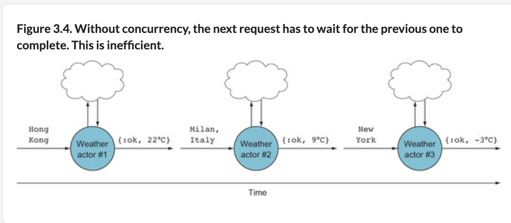
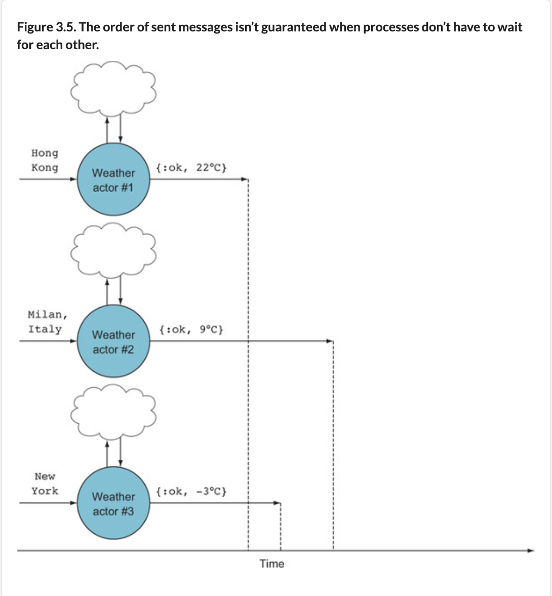

## Creating Processes for Concurrency

How to get temperatures for MANY cities? We could send requests to the worker one at a time:
```
> cities |> Enum.map(fn city ->
    Metex.Worker.temperature_of(city)
  end)

["Singapore: 27.5°C", "Monaco: 7.3°C", "Vatican City: 10.9°C", "Hong Kong: 18.1°C", "Macau: 19.5°C"]
```
But this is slow and wasteful. These requests are `synchronous`; each must wait for the last one to finish.


These requests could run concurrently instead. We may package each call to `Metex.Worker.temperature_of/1` in a process.

Add recursive `loop/0` to `lib/worker.ex` to teach worker how to respond to messages:
```
defmodule Metex.Worker do

  def loop do
    receive do
      {sender_pid, location} ->
        send(sender_pid, {:ok, temperature_of(location)})
      _ ->
        IO.puts "Don't know how to process this message"
    end
    loop
  end

  defp temperature_of(location) do
    # ...

  end
  # ...
end
```
Let's play around with this in `iex`. Let's reload the module:
```
> r(Metex.Worker)
{:reloaded, [Metex.Worker]}
```
Make a process that runs `loop/0`:
```
> pid = spawn(Metex.Worker, :loop, [])
#PID<0.220.0>
```
The `spawn()` function creates a process. It has two versions. [spawn/1](https://hexdocs.pm/elixir/1.16/Kernel.html#spawn/1) (version 1) takes a single function as a parameter. [spawn/3](https://hexdocs.pm/elixir/1.16/Kernel.html#spawn/3) (version 2) takes a module, a symbol representing the function name, and a list of input arguments. Both versions return a process id (`pid`).

Elixir docs: [Spawning Processes](https://hexdocs.pm/elixir/processes.html#spawning-processes).

***Receiving Messages***

Elixir docs: [Sending + Receiving Messages](https://hexdocs.pm/elixir/processes.html#sending-and-receiving-messages).

A `pid` is a reference to a process---like in object-oriented programming the result of initializing an object is a reference to that object. With the `pid`, you can send the process messages. The kinds of messages the process can receive are defined in the `receive` block:
```
receive do
  {sender_pid, location} ->
    send(sender_pid, {:ok, temperature_of(location)})
  _ ->
    IO.puts "don't know how to process this message"
end
```
Messages are pattern-matched from top to bottom. So here, if the incoming message is a 2-element tuple, the body will be executed. Any other message will be pattern-matched in the second pattern.

You may not switch order of receive functions:
```
receive do
  _ ->
    IO.puts "don't know how to process this message"
  {sender_pid, location} ->
    send(sender_pid, {:ok, temperature_of(location)})
end
...
lib/worker.ex:7: warning: this clause cannot match because a previous
clause at line 5 always matches
```
In other words, `{sender_pid, location}` will never be matched because the match-all operator (`_`) will greedily match every single message that comes its way.

it’s good practice to have the match-all case as the last message to be matched. It's because unmatched messages are kept in the mailbox. Thus it’s possible to make the VM run out of memory by repeatedly sending messages to a process that doesn’t handle unmatched messages.

***Sending Messages***

Send messages with [send/2](https://hexdocs.pm/elixir/1.16/Kernel.html#send/2). First argument: pid of the target process of this message. Second argument: actual message.
```
receive do
  {sender_pid, location} ->
    send(sender_pid, {:ok, temperature_of(location)})
end

```
Here, we send request result to `sender_pid`, the same process that ! You expect the incoming message to consist of the sender’s pid and the location. Putting in the sender’s pid (or any process id, for that matter) is like putting a return address on an envelope: it gives the recipient a place to reply to.

Now send message to the process we spawned before:
```
> send(pid, {self, "Singapore"})
{#PID<0.209.0>, "Singapore"}
```
`self` = pid of the calling process. Here, it's the pid of this `iex` shell session. We telling the worker to send all replies to this shell session. To get back responses from the shell session, use [flush/1](https://hexdocs.pm/elixir/StringIO.html#flush/1) to empty the process mailbox.

Each Elixir processes has its own mailbox. Messages sent to a process are placed at the end of the mailbox. When a process reads from its mailbox, with `receive`, the message is removed from the front of its queue. Multiple processes can send messages to the same target process, but that target process can only process 1 message at a time.

```
> cities = ["Singapore", "Monaco", "Vatican City", "Hong Kong", "Macau"]
```
Loop through each city, spawning a new worker for each. Use `pid` of each new worker to send the worker process a 2-element tuple as a message containing the return address (the `iex` shell session) and the city:
```
> cities |> Enum.each(fn city ->
    pid = spawn(Metex.Worker, :loop, [])
    send(pid, {self, city})
  end)
```
`flush` prints and clears out all messages sent to the `iex` shell. Thus the next time we `flush`, we only get `:ok`.
```
> flush
{:ok, "Singapore: 26.8°C"}
{:ok, "Vatican City: 15.1°C"}
{:ok, "Hong Kong: 15.5°C"}
{:ok, "Macau: 15.8°C"}
{:ok, "Monaco: 16.5°C"}
:ok

> flush
:ok
```
We finally get back temperatures for all 5 cities. **Note results aren’t in any particular order.** That’s because the response that completed first sent its reply back to the sender as soon as it was finished. If we run the iteration again, we'll probably get results in a different order:



In our `loop()`, why does it call itself (recursive)?
```
  def loop do
    receive do
      {sender_pid, location} ->
        send(sender_pid, {:ok, temperature_of(location)})
      _ ->
        IO.puts "Don't know how to process this message"
    end
    loop
  end
```
Because the process should handle more than one message. If we left out the recursive call, as soon as the process handled that first (and only) message, it would exit and be garbage-collected. We usually want processes to handle more than one message!
