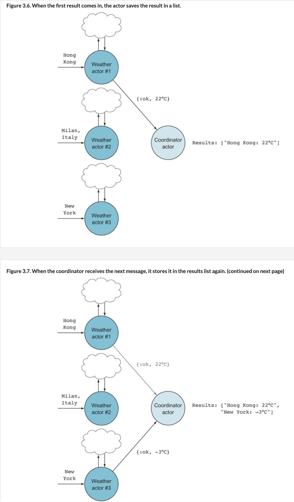

## Collecting/Manipulating Results with Another Actor
To manipulate results, we can't use shell session as sender. We create another actor to collect results. This actor must keep state, or track how many messages expected.

Make actor [`lib/coordinator.ex`](https://github.com/rayning0/metex/blob/master/lib/coordinator.ex).
```
defmodule Metex.Coordinator do

  def loop(results \\ [], results_expected) do
    receive do
      {:ok, result} ->
        new_results = [result|results]
        if results_expected == Enum.count(new_results) do
          send self(), :exit
        end
        loop(new_results, results_expected)
      :exit ->
        IO.puts(results |> Enum.sort |> Enum.join(", "))
      _ ->
        loop(results, results_expected)
    end
  end

end
```
Change [`lib/metex.ex`](https://github.com/rayning0/metex/blob/master/lib/metex.ex) to spawn a coordinator process and many worker processes, one for each city.
```
defmodule Metex do
  def temperatures_of(cities) do
    coordinator_pid =
      spawn(Metex.Coordinator, :loop, [[], Enum.count(cities)])
    cities |> Enum.each(fn city ->
      worker_pid = spawn(Metex.Worker, :loop, [])
      send worker_pid, {coordinator_pid, city}
    end)
  end
end

```
Use `Metex.Coordinator` to monitor these worker processes.

`Metex` spawns a `Metex.Coordinator` process, then loops through a list of cities. For each city, it spawns a new `Metex.Worker` process. `Metex` sends the same coordinator PID with each different city to that new worker.

Each [worker](https://github.com/rayning0/metex/blob/master/lib/worker.ex) calls OpenWeather's API to get that city's temperature, which it sends back to the `Metex.Coordinator`. The coordinator tracks the number of workers sending it temperatures.

When the number of temperatures from all workers equals number of expected temperatures, `Metex.Coordinator` exits and print a list of all temperatures.
```
> cities = ["Singapore", "Monaco", "Vatican City", "Hong Kong", "Macau"]
> Metex.temperatures_of(cities)

Hong Kong: 17.8°C, Macau: 18.4°C, Monaco: 8.8°C, Singapore: 28.6°C, Vatican
City: 8.5°C
```
All these processes run concurrently in less than 1 second.

Let's break down what I just said again:

1. `Metex` creates a `Metex.Coordinator` process. The coordinator's `loop()` expects 2 inputs. We initialize the coordinator with an empty list [] and the number of cities.
  - Current collected list of `results`
  - Total number of expected results: `results_expected`
```
> coordinator_pid = spawn(Metex.Coordinator, :loop, [[], Enum.count(cities)])
#PID<0.295.0>
```
2. The coordinator process waits for a message from each `Metex.Worker`. `Metex` loops through each city, creates a new worker process, then sends that worker a message with the same coordinator PID and that different city.
```
> cities |> Enum.each(fn city ->
    worker_pid = spawn(Metex.Worker, :loop, [])
    send worker_pid, {coordinator_pid, city}
  end)
```
3. When all 5 workers have finished getting temperatures and sending them back to the coordinator, the coordinator exits and prints the list of temperatures.
```
Hong Kong: 18.5°C, Los Angeles: 11.5°C, Monaco: 11.8°C, Singapore: 25.6°C, Vatican City: 15.1°C
```
The coordinator may get 2 major message types: `{:ok, result}` or `:exit`. These drawings summarize steps of this code, with 3 cities:




Yay! We've just written our first concurrent program in Elixir! We used multiple processes to perform computations concurrently. The processes didn’t wait for each other while performing computations (except the coordinator process).

There’s no shared memory. The only way a change of state can occur within a process is when a message is sent to it. This is different from threads, since threads share memory. That means multiple threads can modify the same memory, an endless source of concurrency bugs (and headaches). [Difference between processes and threads](../elixir_school/mit_concurrency-process_thread_race-conditions.md#processes).

When designing concurrent programs, we must decide which types of messages the processes should receive and send, plus the interactions between processes. In the example program, we used `{:ok, result}` and `:exit` for the coordinator process and `{sender_pid, location}` for the worker process. It helps to sketch out interactions between various processes, plus messages being sent and received. Resist temptation to dive right into coding. Spend a few minutes sketching.
