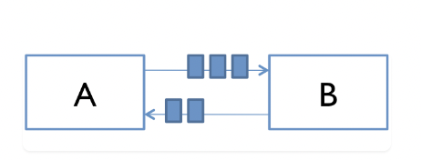

**Definition**

Jump to [Processes vs. Threads](#processes)

`Concurrency`: Concurrency is 2 lines of customers ordering from a single cashier (lines take turns ordering), or 1 waiter serving many customers. `Parallelism` is 2 lines of customers ordering from 2 cashiers (each line gets its own cashier).

Difference between concurrency + parallelism:
1. [Concurrency is about dealing with lot of things at once, while  parallelism is about doing lot of things at once](https://stackoverflow.com/a/76954105/2175188).
2. [Get passport + do presentation example](https://stackoverflow.com/a/24684037/2175188).

**MIT course ("Software Construction") on concurrency**

[MIT course definition](https://web.mit.edu/6.005/www/fa14/classes/17-concurrency/):
- Concurrency: multiple computations are happening at same time.
  - Multiple computers in a network
  - Multiple applications running on one computer
  - Multiple processors in a computer (today, often multiple processor cores on a single chip)

- It's everywhere in software:
  - Web sites must handle multiple simultaneous users.
  - Mobile apps need to do some of their processing on servers (“in the cloud”).
  - GUIs almost always require background work that does not interrupt the user. For example, Eclipse compiles your Java code while you’re still editing it.

- We’re getting more cores with each new generation of CPUs. So in the future, in order to run a computation faster, we must split it into concurrent pieces.

**2 Models for How Concurrent Modules Communicate**

`Shared Memory`: concurrent modules interact by reading and writing shared objects in memory. Examples:
- A and B may be 2 processors (or processor cores) in the same computer, sharing the same physical memory.
- A and B may be 2 programs running on the same computer, sharing a common filesystem with files they can read and write.
- A and B may be 2 threads in the same Java program (we’ll explain what a thread is below), sharing the same Java objects.


`Message Passing` ([Elixir/Erlang way](https://elixirschool.com/en/lessons/intermediate/concurrency#message-passing-1)): concurrent modules interact by sending messages to each other through a communication channel. Modules send off messages, and incoming messages to each module are queued up for handling. Examples:
- A and B may be 2 computers in a network communicating by network connections.
- A and B may be a web browser and a web server. A opens connection to B, asks for a web page, then B sends web page data back to A.
- A and B may be an instant messaging client and server.
- A and B may be 2 programs running on same computer whose input and output have been connected by a pipe, like `ls | grep` typed into a command prompt.



**2 Types of Concurrent Modules**<a id="processes"></a>

`Process`: an independent running program with its own memory space and resources. **It's isolated from other processes** on same machine. Has its own private section of the machine’s memory. Takes more time to terminate. May have these 6 states: **"New, ready, running, waiting, terminated, and suspended."** The operating system’s scheduler determines the order and duration of process execution, giving illusion of parallelism to users.

A process includes: the program code, its current activity, and a unique process ID (PID). Each process runs in its own memory space and has its own set of system resources, such as registers, variables, and file descriptors.

The process abstraction is a `virtual computer`. It makes the program feel like it has the entire machine to itself – like a fresh computer has been created, with fresh memory, just to run that program.

Just like computers connected across a network, **processes share no memory between them. A process can’t access another process’s memory or objects.** Sharing memory between processes is possible on most operating system, but it needs special effort. By contrast, a new process is automatically ready for [message passing](https://cs.lmu.edu/~ray/notes/messagepassing/).

**Processes communicate through inter-process communication mechanisms, such as message passing or shared files.**

____

`Thread`: **a lightweight unit of execution within a process that shares the same memory space**. A locus of control inside a running program. A place in the program that is being run, plus the stack of method calls that led to that place to which it will be necessary to return through. **A process may have multiple threads (`multithreading`). A thread has 3 states: "Running, Ready, and Blocked."**

**A way for a program to divide its tasks into smaller, more manageable units of work that can be executed concurrently.** Each thread can perform a different task simultaneously, letting the program to use processing power of multiple CPU cores or processors. Threads can also be used to implement concurrency and synchronization, letting multiple threads to access shared resources in a safe and controlled manner. Threads help programs run faster and more efficiently by dividing workloads and working together.

The thread abstraction represents a `virtual processor`. Making a new thread simulates making a fresh processor inside the virtual computer represented by the process. This new virtual processor **runs the same program and shares the same memory as other threads in process**.

**Threads, as part of the same process, communicate through shared memory and can directly access the same variables and data structures.**

A thread needs special effort to get “thread-local” memory that’s private to a single thread. It’s also necessary to set up message-passing explicitly, by creating and using queue data structures.

____

**Q: How can I have many concurrent threads with only 1 or 2 processors in my computer?** When there are more threads than processors, concurrency is simulated by `time slicing`: the processor switches between threads. The figure on the right shows how three threads T1, T2, and T3 might be time-sliced on a machine that has only two actual processors. In the figure, time proceeds downward, so at first one processor is running thread T1 and the other is running thread T2, and then the second processor switches to run thread T3. Thread T2 simply pauses, until its next time slice on the same processor or another processor.


On most systems, time slicing happens unpredictably and nondeterministically, meaning that a thread may be paused or resumed at any time.

**Q: Advantages of processes vs. threads?**

Processes offer greater isolation and robustness since they have separate memory spaces. This isolation can enhance system stability, but processes may have higher overhead. Threads, being lightweight and sharing resources, can be more efficient in terms of memory usage and communication but may be more prone to errors due to shared state.

**Q: When should I use processes vs. threads?**

Processes are better when strong isolation is required between tasks, like in independent applications. Threads are better when tasks must share data efficiently and communicate quickly in the same program, like in parallel computing or GUI applications.

**[Difference between Process vs. Thread](https://www.prepbytes.com/blog/operating-system/difference-between-process-and-thread/):**

1. A process is an instance for program execution. A thread is a lightweight process that exists within a process.

2. Each process has its own memory space.	Threads share same memory space as the process that created them.

3. Each process runs independently of other processes. Threads in a process share the same resources and run concurrently.

4. Processes are created and destroyed independently of each other.	Threads are created and destroyed within a process.

5. Context switching is slower in a process compared to in a thread.

6. Processes must use interprocess communication (IPC) to communicate with each other.	Threads in a process can easily share data and communicate with each other with shared memory.

7. Processes provides better security + stability than threads, since they run in separate memory spaces.	If one thread crashes, it can potentially affect other threads running in the same process.

8. A process can contain multiple threads. A thread cannot contain other threads.

9. In a process, all threads share the same `heap`.	Each thread has its own private `stack`.

____

**[Shared Memory Example (MIT course)](https://web.mit.edu/6.005/www/fa14/classes/17-concurrency/#shared_memory_example):**


Imagine a bank has cash machines that use a `shared memory` model, so all cash machines can read/write the same account objects in memory.

Simplify the bank to a single account, with a $1 dollar balance stored in the balance variable and 2 operations `deposit` and `withdraw` that simply add or remove $1:
```
// suppose all cash machines share a single bank account
private static int balance = 0;

private static void deposit() {
    balance = balance + 1;
}
private static void withdraw() {
    balance = balance - 1;
}
```
Customers use these cash machines to do transactions like this:
```
deposit(); // put a dollar in
withdraw(); // take it back out
```
Each transaction is just a $1 deposit followed by a $1 withdrawal, so it should leave the balance in the account unchanged. Throughout the day, each cash machine in our network processes a sequence of deposit/withdraw transactions.
```
// each ATM does a bunch of transactions that
// modify balance, but leave it unchanged afterward
private static void cashMachine() {
    for (int i = 0; i < TRANSACTIONS_PER_MACHINE; ++i) {
        deposit(); // put a dollar in
        withdraw(); // take it back out
    }
}
```
So at end of day, regardless how many cash machines were running or how many transactions we processed, the account balance should still be $0.

But if we run this code, we discover often the balance at end of day is not $0. **If more than one cashMachine() call is running at the same time – like on separate processors in the same computer – the balance may not be $0 at end of day. Why not?**

**Interleaving**

Suppose 2 cash machines A and B both work on a deposit at the same time. Here’s how the `deposit()` step typically breaks down into low-level processor instructions:
```
get balance (balance=0)
add 1
write back the result (balance=1)
```
When A and B run concurrently, these low-level instructions `interleave` with each other:
```
A get balance (balance=0)
A add 1
A write back the result (balance=1)
                                    B get balance (balance=1)
                                    B add 1
                                    B write back the result (balance=2)
```
This interleaving is fine – we end up with balance $2, so both A and B successfully put in $1. But what if the interleaving looked like this?
```
A get balance (balance=0)
                                    B get balance (balance=0)
A add 1
                                    B add 1
A write back the result (balance=1)
                                    B write back the result (balance=1)
```
The balance is now $1---A’s dollar was lost! A and B both read the balance at the same time, computed separate final balances, then raced to store back the new balance, ignoring the other's deposit!

**Race Condition**

This is an example of a `race condition`: correctness of the program (satisfaction of postconditions and invariants) depends on the relative timing of events in concurrent computations A and B. When this happens, “A is in a race with B.”

Some interleavings of events may be OK, if they are consistent with what a single, nonconcurrent process would produce, but other interleavings produce wrong answers, violating postconditions or invariants.

- Tweaking Code Won’t Help

All these versions of the bank account code show the same race condition:
```
// version 1
private static void deposit() {
    balance = balance + 1;
}
private static void withdraw() {
    balance = balance - 1;
}

// version 2
private static void deposit() {
    balance += 1;
}
private static void withdraw() {
    balance -= 1;
}

// version 3
private static void deposit() {
    ++balance;
}
private static void withdraw() {
    --balance;
}
```
You can’t tell from looking at Java code how the processor is going to execute it. You can’t tell what the indivisible operations (the atomic operations) will be. It isn’t atomic just because it’s one line of Java. It doesn’t touch the balance only once just because the balance identifier occurs only once in the line. The Java compiler, and in fact the processor itself, makes no commitments what low-level operations it will generate from your code. A typical modern Java compiler produces exactly the same code for all 3 of these versions!

Lesson: **You can’t tell by looking at an expression whether it will be safe from race conditions**.

- Reordering

It’s even worse than that. **When using multiple variables and multiple processors, you can’t count on changes to those variables appearing in the same order!**
```
private boolean ready = false;
private int answer = 0;

// computeAnswer runs in one thread
private void computeAnswer() {
    answer = 42;
    ready = true;
}

// useAnswer runs in a different thread
private void useAnswer() {
    while (!ready) {
        Thread.yield(); \\ Yield tells CPU to stop running current thread and first run threads with higher priority.
    }
    if (answer == 0) throw new RuntimeException("answer not ready!");
}
```
We have 2 methods that running in different threads. `computeAnswer` does a long calculation, ending with answer 42, which it puts in the answer variable. Then it sets `ready` to true, to signal the method running in the other thread, `useAnswer`, that `answer` is ready for it to use.

It seems `answer` is set before `ready`, so once `useAnswer` sees `ready` is true, we can assume `answer` will be 42, right? No!!

The problem? Modern compilers/processors do many things to make code fast. One thing is **making temporary copies of variables like `answer` and `ready` in faster storage (registers or caches on a processor), then working with them temporarily before eventually storing them back to their official memory locations.**

**The storeback may occur in a different order than the variables were manipulated in your code.** Here’s what may go on under the cover. The processor is effectively creating two temporary variables, `tmpr` and `tmpa`, to manipulate fields `ready` and `answer`:
```
private void computeAnswer() {
    boolean tmpr = ready;
    int tmpa = answer;

    tmpa = 42;
    tmpr = true;

    ready = tmpr;
                   // <-- what happens if useAnswer() interleaves here, run by 2nd CPU?
                   // "ready" is set, but "answer" isn't.
    answer = tmpa;
}
```

**[Message Passing Example (MIT course), used by Elixir](https://web.mit.edu/6.005/www/fa14/classes/17-concurrency/#message_passing_example):**


How about a `message passing` approach to our bank account example?

Now not only are cash machines modules, but accounts are modules, too. They're not just memory locations. **Modules interact by sending messages to each other. Incoming requests are placed in a queue to be handled one at a time. The sender doesn’t stop working while waiting for answer to its request. It handles more requests from its own queue. The reply to its request later comes back as another message.**

**Unfortunately, message passing doesn’t eliminate race conditions.** Suppose each account supports `get-balance` and `withdraw` operations, with corresponding messages. Two users, at cash machine A and B, are both trying to withdraw a dollar from the same account. They check the balance first to make sure they never withdraw more than the account holds, because overdrafts trigger big bank penalties:
```
get-balance
if balance >= 1 then withdraw 1
```
The problem is again interleaving, but this time interleaving of messages sent to the bank account, rather than the instructions executed by A and B. If the account starts with $1 in it, then what interleaving of messages will fool A and B into thinking they can both withdraw a dollar, overdrawing the account?

We must carefully choose operations of a message-passing model. `withdraw-if-sufficient-funds` is a better operation than just `withdraw`.

**Concurrency is Hard to Test and Debug**

It’s very hard to discover race conditions using testing. Even once a test has found a bug, it may be very hard to localize it to the part of the program causing it.

**Concurrency bugs exhibit very poor reproducibility. It’s hard to make them happen the same way twice.** Interleaving of instructions or messages depends on relative timing of events that are strongly influenced by the environment. Delays can be caused by other running programs, other network traffic, operating system scheduling decisions, variations in processor clock speed, etc. Each time you run a program with a race condition, you may get different behavior.

These kinds of bugs are `heisenbugs`, nondeterministic and hard to reproduce, as opposed to a `bohrbug`, which shows up repeatedly whenever you look at it. Almost all bugs in sequential programming are bohrbugs.

**A heisenbug may even disappear when you try to look at it with println or debugger!** The reason is that printing and debugging are so much slower than other operations, often 100-1000x slower, that they dramatically change the timing of operations and the interleaving. So inserting a simple print statement into the cashMachine():
```
private static void cashMachine() {
    for (int i = 0; i < TRANSACTIONS_PER_MACHINE; ++i) {
        deposit(); // put a dollar in
        withdraw(); // take it back out
        System.out.println(balance); // makes the bug disappear!
    }
}
```
and suddenly the balance is always 0, as desired, and the bug appears to disappear. But it’s only masked, not truly fixed. A change in timing somewhere else in the program may suddenly make the bug come back.

Concurrency is hard to get right. Part of the point of this reading is to scare you a bit. Over the next several readings, we’ll see principled ways to design concurrent programs so that they are safer from these kinds of bugs.
